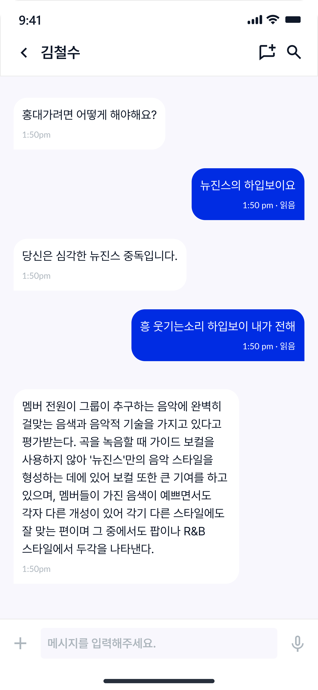

## Key Questions

- JavaScript를 사용할때에 비해 TypeScript를 사용할 때의 장점은 무엇인가요?
- 디자이너로부터 전달받은 피그마 링크 혹은, 피그마 캡처본
- 컴포넌트를 분리한 기준은 무엇인가요?
- 디자인 시스템을 적용하면서 느낀 점은 무엇인가요?
- 디자이너와 소통하며 느낀점은 무엇인가요?

## 디자인 초안 

## 기한

2023년 9월 29일 금요일

## 필수 구현 기능

- [x] 피그마를 보고 [결과화면](https://3th-fb-messenger.netlify.app)과 같이 구현합니다. 
- [x] 디자인 시스템을 구축합니다.
- [x] 채팅방 상단의 프로필을 클릭하면 사용자를 변경할 수 있습니다.
- [x] 메세지를 보내면 채팅방 하단으로 스크롤을 이동시킵니다.
- [x] 메세지에 유저 정보(프로필 사진, 이름)를 표시합니다. - 메시지 색깔 구분
- [x] user와 message 데이터를 json 파일에 저장합니다.
- [x] UI는 **반응형을 제외**하고 피그마파일을 따라서 진행합니다.

### 추가 구현 기능

- 채팅창 포커스 기능
- 그 외 추가하고 싶은 기능이 있다면 마음껏 추가해 주세요!

참고로 이번 과제는 다음주까지 이어지는 과제이므로 **확장성**을 충분히 고려해 주세요. 참고로 **4주차 과제에서는 유저 및 기능 추가와 Routing을** 진행합니다. 이를 위해 [recoil](https://recoiljs.org/ko/)이나 [redux](https://ko.redux.js.org/introduction/getting-started/)를 이용한 상태관리를 미리 해보시는 것을 추천합니다!! 모두 공식문서 많이 읽어보시고 자신만의 상태관리 조합도 찾아보면 재밌을 거에요 XD

